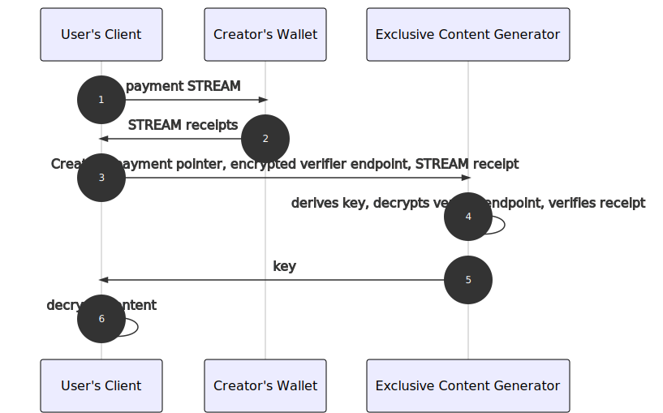

One of the perks of Web Monetization is that its JavaScript API can be used to make your page respond to Web Monetization. You can reward the people who support your site by giving web monetized viewers exclusive content.

## A basic example

Web Monetization makes providing exclusive content easy! This is a very simple example of showing exclusive content only to web monetized visitors:

> **Careful!** These examples hide content on the client side. A clever user
> could pretend to be web monetized by using the developer console. Examples on
> how to verify Web Monetization can be found [further down](#exclusive-content-with-payment-verification).

### Code

```html
<head>
  <!-- this should be set to your own payment pointer -->
  <meta name="monetization" content="$wallet.example.com/alice" />

  <style>
    .hidden {
      display: none;
    }
  </style>

  <script>
    if (document.monetization) {
      document.monetization.addEventListener('monetizationstart', () => {
        document.getElementById('exclusive').classList.remove('hidden')
      })
    }
  </script>
</head>

<body>
  <p>Content will appear below here if you are Web monetized.</p>
  <hr />
  <div id="exclusive" class="hidden">Here's some exclusive content!</div>
</body>
```

### How does it work?

There's only three things this code does. The code is encompassed in the `<script>` tag.

First, we check whether `document.monetization` exists in the browser. If it doesn't exist, then we can't listen for the `monetizationstart` event to tell us when Web Monetization initializes.

```js
if (document.monetization) {
```

Next, we add an event listener to the `document.monetization` object. The
`monetizationstart` event is emitted when Web Monetization initializes and
the state goes from `pending` to `started`.

```js
document.monetization.addEventListener('monetizationstart', () => {
```

Finally, we select our exclusive content element and make it visible. We defined a CSS class that made it hidden, so removing that class will make it visible. If you want to do something else when Web Monetization starts, you can replace this line. You can trigger any JavaScript, so the sky's the limit.

```js
document.getElementById('exclusive').classList.remove('hidden')})
}
```

### Interactive example

This example simulates showing exclusive content to a web monetized visitor and hiding the content from a non-web monetized visitor. The example doesn't require you to have Web Monetization enabled in your browser. No real payments are occurring.

Click the **View as Web Monetized/non-Web Monetized visitor** button to toggle your monetization state.

If you see the source files instead of the example, click **View App** in the bottom right.

<div class="glitch-embed-wrap" style={{ height: '420px', width: '100%' }}>
  <iframe
    src="https://glitch.com/embed/#!/embed/wm-exclusive-content-basic?path=README.md&previewSize=100"
    title="wm-exclusive-content-basic on Glitch"
    allow="geolocation; microphone; camera; midi; vr; encrypted-media"
    style={{ height: '100%', width: '100%', border: '0' }}>
  </iframe>
</div>

## A complete example

In reality, your requirements will be a little more complex. You should:

- Show web monetized visitors an indicator while they wait for Web Monetization to initialize.
- Tell non-web-monetized visitors that there's exclusive content they can get.

This means there's three states in total:

- Show a call-to-action to a non-web-monetized visitor
- Show a loading message to a web monetized visitor
- Show exclusive content to a web monetized visitor

### Code

```html
<head>
  <!-- this should be set to your own payment pointer -->
  <meta name="monetization" content="$wallet.example.com/alice" />

  <style>
    .hidden {
      display: none;
    }
  </style>

  <script>
    function showExclusiveContent() {
      document.getElementById('exclusive').classList.remove('hidden')
      document.getElementById('loading').classList.add('hidden')
      document.getElementById('cta').classList.add('hidden')
    }

    function showCTA() {
      document.getElementById('loading').classList.add('hidden')
      document.getElementById('cta').classList.remove('hidden')
    }

    function showLoading() {
      document.getElementById('loading').classList.remove('hidden')
    }

    if (document.monetization) {
      document.monetization.addEventListener('monetizationstart', () => {
        showExclusiveContent()
      })
    }

    window.addEventListener('load', () => {
      if (!document.monetization) {
        showCTA()
      } else {
        showLoading()
      }
    })
  </script>
</head>

<body>
  <div id="loading" class="hidden">Loading exclusive content...</div>

  <div id="exclusive" class="hidden">Here's some exclusive content!</div>

  <div id="cta" class="hidden">
    Please install a Web Monetization extension to support me!
  </div>
</body>
```

### How does it work?

We have three functions to activate our three different states: `showLoading` displays the loader, `showCTA` displays the call-to-action to get web monetized, and `showExclusiveContent` shows the exclusive content. This works just like the [basic example](#a-basic-example) where we turn the `hidden` class on/off for our `div`s.

When the visitor is web monetized, we listen for the `monetizationstart` event. Just like the previous example, this event will show the exclusive content when it's triggered and hide the other `div`s.

```js
if (document.monetization) {
  document.monetization.addEventListener('monetizationstart', () => {
    showExclusiveContent()
  })
}
```

When the page loads, we check whether Web Monetization exists in the visitor's browser.

```js
window.addEventListener('load', () => {
```

If the visitor doesn't have Web Monetization, then we show the CTA right
away. If the visitor does have Web Monetization, we show the loader
right away.

```js
if (!document.monetization) {
  showCTA()
} else {
  showLoading()
}
```

### Interactive example

This example simulates showing and hiding content based on whether your visitor is web monetized. Web monetized visitors will see exclusive content that's hidden from non-web monetized viewers. Non-web monetized visitors will see the message, "Please install a Web Monetization extension to support me", which is hidden from web monetized visitors.

The example doesn't require you to have Web Monetization enabled in your browser. No real payments are occurring.

Click the **View as Web Monetized/non-Web Monetized visitor** button to toggle your monetization state.

If you see the source files instead of the example, click **View App** in the bottom right.

<div class="glitch-embed-wrap" style={{ height: '420px', width: '100%' }}>
  <iframe
    src="https://glitch.com/embed/#!/embed/wm-exclusive-content-advanced?path=README.md&previewSize=100"
    title="wm-exclusive-content-advanced on Glitch"
    allow="geolocation; microphone; camera; midi; vr; encrypted-media"
    style={{ height: '100%', width: '100%', border: '0' }}>
  </iframe>
</div>

## Exclusive content with payment verification

The above examples only hide content client side which could be spoofed by a clever user.
Since the introduction of STREAM receipts it is possible to verify payments using a [STREAM receipt verifier](/docs/receipt-verifier).

The Exclusive Content Generator allows users to generate an encrypted piece of content that can be embedded on the web page.

:::info
Want to try the Exclusive Content Generator right away? Check it out [here](/exclusive-content).
:::

### How does it work?

The Exclusive Content Generator derives an encryption key from the user's payment pointer and a master key and returns it to the Creator's client. The client then encrypts the exclusive content and the verifier endpoint and displays all the information required for decryption in a <code>div</code> tag. It also provides a JavaScript script to be embedded on the Creator's web page.


The embedded JavaScript script will parse all the exclusive content <code>div</code> tags and include the proxy payment pointer in the web page's header (if there are multiple, it will select one at random). If Web Monetization is enabled by the User, receipts can now be obtained from the <code>monetizationprogress</code> events. The receipts, together with the payment pointer and the encrypted verifier endpoint, are submitted to the Exclusive Content Generator, which derives the encryption key and decrypts the verifier endpoint. If the Exclusive Content Generator is able to verify the receipts with the STREAM receipt verifier, it shares the encryption key with the User's client, who is now able to decrypt the content and display it.



### Interactive example

The example page will request the decryption key for each piece of exclusive content if Web Monetization is enabled. If it is not enabled, it will say "🔒 This content is exclusive for users with Web Monetization enabled."

The preview below simulates showing exclusive content to a web monetized visitor and hiding the content from a non-web monetized visitor. The example doesn't require you to have Web Monetization enabled in your browser. No real payments are occurring.

Click the **View as Web Monetized/non-Web Monetized visitor** button to toggle your monetization state.

If you see the source files instead of the example, click **View App** in the bottom right.

<div class="glitch-embed-wrap" style={{ height: '420px', width: '100%' }}>
  <iframe
    src="https://glitch.com/embed/#!/embed/exclusive-content-demo-simulation?path=index.html&previewSize=100"
    title="exclusive-content-demo-simulation on Glitch"
    allow="geolocation; microphone; camera; midi; vr; encrypted-media"
    style={{ height: '100%', width: '100%', border: '0', paddingBottom: '30px' }}>
  </iframe>
</div>

If you want to interact with a fully functionable example which **does require you to have Web Monetization enabled in your browser**, visit [this demo page](https://exclusive-content-demo.glitch.me/) with Web Monetization enabled.
