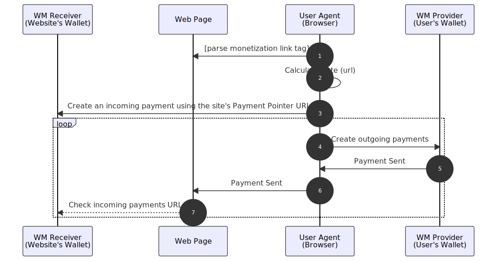

Web Monetization (WM) is a proposed API standard that allows websites to request
a stream of very small payments (e.g. fractions of a cent) from a user.

The API's framework provides new revenue models for websites and web-based
services and is an alternative to subscription services and advertising, all
while preserving the user's privacy.

In exchange for payments from the user, websites can provide the user with a
"premium" experience, such as allowing access to exclusive content, removing
advertising, or even removing the need to log in to access content or services.

[Skip straight to code...](#handle-payments)

## Goals

#### Payment
Provide websites with a way to collect multiple small payments from users in
exchange for consuming the site's content and/or services.

#### Frictionless user experience

Allow users to pre-approve payments in aggregate or delegate the authorization
of individual small payments to a component/service (a Web Monetization
  agent) that makes decisions about when and how much to pay websites without
  the need for user interaction.

#### User privacy

This system must preserve the user's privacy. It must not be possible for
websites to track users on the basis of the payments they make, and it must not
be possible for the user's Web Monetization provider to get details of a
user's browsing history.

## Non-goals

#### Online purchases

Web Monetization is intended to enable very small payments. This distinction is
important because very small payments can be performed with different levels of
user consent, unlike larger payments, such as those used in traditional
e-commerce.

## Flow overview

### Prerequisites

* Users must have an account or subscription with a **Web Monetization provider**
(also known as a WM sender).
* Users must have a **Web Monetization agent** installed in their browser with
the necessary authorization to initiate payments from the WM provider on the
user's behalf.
* Websites must sign up with, or run their own, **Web Monetization receiver**.
  > The WM receiver and WM provider do not need a direct relationship. Their
  shared use of the Interledger network allows payments to be sent from the
  WM provider to the WM receiver.

### Sequence diagram



### Flow

The numbers correspond to the diagram above. The flow is simplified to exclude
some edge cases.

1. Sites that support Web Monetization include a `<meta>` tag containing a
[payment pointer](#payment-pointers). The browser (user agent) parses the tag to
determine where to send payments.
2. The browser uses its internal Web Monetization agent to calculate an
appropriate rate of payments to make to the site.
3. The browser generates a unique session ID for this payment session.
4. The browser fetches a unique destination address and shared secret for the
session from the site's payment pointer URL.
5. _(Optional)_ A payment receipt verifier service (operated by the site or a
third party) proxies the request and sends a Receipt Secret to generate receipts
and Receipt Nonce to include in those receipts to the WM Receiver.
6. With the site's page still in focus, the browser begins initiating payments
to the website at the calculated rate from the user's WM provider.
> [Issue 17 - Support Streaming to Background Tabs](https://github.com/WICG/webmonetization/issues/17)<p>What about people listening to monetized music in a background tab?</p>

7. The WM provider sends the payment to the WM receiver.
8. _(Optional)_ The WM receiver generates and sends a receipt to the WM
provider.
9. The WM provider notifies the browser of successful payments.
10. The browser, in turn, dispatches an event that informs the page of the
payment.
11. _(Optional)_ The page confirms payment by sending the receipt to the
verifier service.

## Why is a standard required?

There are many services attempting to provide alternative means to monetize the
web and generate revenue for content creators and service providers without
selling ads.

However, most of these require that the user and the creator/producer/service
provider join a common network that offers to facilitate the transactions
between users and these services.

The result is a fragmented web of closed content and service silos, rather than
the global and open web we desire. Further, users sacrifice their privacy
because the service is both collecting payments from the user and paying out
to the creator/producer/service provider. The service is therefore able to
correlate payments and collect data about which services are accessed by users.

Web Monetization decouples the provider (sender) and the receiver. Using the
browser as an intermediary, the privacy of users is protected and payments can't
be used to track a user across sites.

## Design discussion points

This proposal is modeled on a working implementation that uses a browser
extension to provide the necessary browser-side functionality. However, there
are various design decisions that may be worth discussing further as a community
 as we figure out how Web Monetization could be built directly into browsers.

By bringing this work to the WICG, our goal is to get input from multiple Web
Monetization providers and implementors to refine the design and produce a W3C
standards-track specification.

### Declarative vs imperative API

The current proposal is for a hybrid declarative and imperative API. Websites
declare their ability to accept web monetized payments using a `<meta>` tag in
the page header. Imperatively, a developer can then access the global
`monetization` object on the DOM to track incoming payment streams/events and
react to these (by showing/hiding ads, etc.).

> [Issue 33 - Declarative vs Imperative API](https://github.com/WICG/webmonetization/issues/33)

### Use updated Payment Request and Payment Handler APIs

The Web Payments WG has designed two APIs that follow a similar pattern to Web
Monetization but for a different use case.

The Payment Request API is an imperative API that websites can use to request a
single discrete payment. The API is designed to always prompt the user for
authorization as part of the flow, as the API is designed for payment sizes
where this is necessary. However, nothing prevents the API from also
supporting a non-interactive flow that supports Web Monetization use cases.

The Payment Handler API aligns well with the model anticipated for WM providers.
A provider might manifest as a specialized payment handler capable of returning
not just a `PaymentResponse` but also a handle to a stream of micropayments.

> [Issue 34 - Use Updated Payment Request and Payment Handler APIs?](https://github.com/WICG/webmonetization/issues/34)

### This sounds a lot like streams...

In keeping with the trend toward streaming APIs, the API surface could be
updated to implement the [WHATWG Stream API](https://streams.spec.whatwg.org)
rather than events.

We will investigate the pros/cons of using streams and events for Web
Monetization as part of the incubation process.

> [Issue 27 - Readable Stream vs Progress Event vs Both](https://github.com/WICG/webmonetization/issues/27)

## Concepts

Web Monetization depends on two critical technologies/concepts that enable open
and interoperable payments between providers and websites for very small amounts:
Interledger and payment pointers.

### Interledger

Interledger is a payment messaging protocol for making payments of any size that
can be aggregated and settled over existing payment networks (including those
that do not support very small payment sizes or real-time payments clearing).

The design of the protocol also allows for payments to be made that span
multiple underlying settlement networks, improving the interoperability and
reach of existing networks.

Web Monetization providers and receivers use the Interledger protocol to exchange
payments. The provider and WM receiver might be directly connected or might
connect via one or more intermediaries. This will be driven by the regulatory
requirements and the status of intermediaries as registered money services businesses.

For more details see https://interledger.org.

### Payment pointers

Payment pointers are a convenient and concise way to express a URL that points
to a secure payment initiation endpoint on the Web.

Payment pointers resolve to an HTTPS URL using simple conversion rules.

Using payment pointers, systems that offer payment accounts can give users a
simple and easy-to-remember identifier for their account that's **safe to
share** with 3rd parties (unlike a credit card number) and is immediately
identifiable as a payment account identifier.

> **Example payment pointers:** `$alice.wallet.example` and `$wallet.example/alice`.
>
> These resolve to `https://alice.wallet.example/.well-known/pay` and `https://wallet.example/alice` respectively.

Websites that use Web Monetization require a destination address for their
payments (which they will get from their WM receiver). The address must be inserted
into the appropriate `meta` tag.

For more details see https://paymentpointers.org.

## Getting Started

For a high-level overview, see the [Quick start guide](getting-started.md).

### Set up a receiving account

To use Web Monetization a website owner must have a financial account at a
service provider capable of receiving payments (WM receiver) via the Interledger
protocol.

Such a service (a [digital wallet](ilp-wallets.md), bank, or similar) must provide the website
owner with a payment pointer that serves as the public address for the
account.

> **Example:** Alice owns the website at _**https://<span></span>rocknrollblog.example**_ and
> opens an account at _Secure Receiving Wallet Ltd._. <p>Secure Wallet tells Alice that the
> payment pointer for her account is `$secure-wallet.example/~alice`.</p> <p>For
> privacy reasons Alice might also get the payment pointer</p>
> `$secure-wallet.example/db74f8b4-d6a0-4489-a021-e785e5efb229` or be able to
> generate new addresses on demand (this would be a feature of her WM receiver).

### Add &lt;meta&gt; tag to website header

The website contains a `<meta>` tag in the header of the HTML documents it
serves. The tag's `name` attribute must always have the value `monetization`.
The value of the `content` attribute is the payment pointer where the website
will accept payments.

> **Example:** Alice puts the tag
> `<meta name="monetization" content="$secure-wallet.example/~alice">` into the
> `<head>` section of _**https://<span></span>rocknrollblog.example**_.

Web Monetization only works on pages containing the `meta` tag. Pages must be
secure (served over HTTPS, or `http://localhost` for testing) to preclude bad
actors, like ISPs injecting their own `<meta>` tags into pages.

> [Issue 14 (Closed) - Legitimate Meta Tags](https://github.com/WICG/webmonetization/issues/14)<p>
How do we ensure only legitimate tags are parsed by the browser?</p>

### Handle payments

When a user visits a monetized site with a supported browser the site will find a
`document.monetization` object in the DOM. The object will have a `state`
property that the website can check to determine if the user's WM provider has
started sending payments.

The `document.monetization` object will emit events when monetization starts and
then subsequently each time a payment is sent successfully by the WM provider. The
start event will contain a unique identifier for the payment stream that can be
used to correlate the payments at the WM receiver with the user's current browser
session.

> **Example:** Alice adds the client-side code shown below to her website to
> listen for the relevant monetization events. Now her site only shows
> advertising if she isn't receiving payments.

```html
<head>
  <meta name="monetization" content="$secure-wallet.example/~alice" />
</head>
<script>
  if (document.monetization) {
    document.monetization.addEventListener('monetizationstart', event => {
      // User has an open payment stream

      // Connect to backend to validate the session using the request id
      const { paymentPointer, requestId } = event.detail
      if (!isValidSession(paymentPointer, requestId)) {
        console.error('Invalid requestId for monetization')
        showAdvertising()
      }
    })

    document.monetization.addEventListener('monetizationprogress', event => {
      // A payment has been received

      // Connect to backend to validate the payment
      const {
        paymentPointer,
        requestId,
        amount,
        assetCode,
        assetScale,
        receipt
      } = event.detail
      if (
        isValidPayment(paymentPointer, requestId, amount, assetCode, assetScale, receipt)
      ) {
        // Hide ads for a period based on amount received
        suspendAdvertising(amount, assetCode, assetScale)
      }
    })
    // Wait 30 seconds and then show ads if advertising is no longer suspended
    setTimeout(maybeShowAdvertising, 30000)
  } else {
    showAdvertising()
  }
</script>
```
> [Issue 16 - Use `PaymentCurrencyAmount` Dictionary](https://github.com/WICG/webmonetization/issues/16)<p>
Should the amount in the `monetizationprogress` event use the existing [`PaymentCurrencyAmount`](https://www.w3.org/TR/payment-request/#paymentcurrencyamount-dictionary) type?</p>

## Browser behavior

A web monetized browser exposes a `document.monetization` DOM object that
implements [EventTarget](https://developer.mozilla.org/en-US/docs/Web/API/EventTarget)
and has a read-only [`state` property](api.md#states). The object allows you to
track Web Monetization events and see whether the user visiting your page is web monetized.

1.  If the browser finds a valid payment pointer in a page's `<meta>`
    tag it generates a fresh UUID (version 4) and uses this as the **session
    ID** from this point forward.

    > This session ID **MUST** be unique per page load, **NOT** per browser,
    session, or site.

    * The `<meta>` tag **MUST** be in the `<head>` of the document.
    * If the `<meta>` tag is well-formed, the browser will extract the payment
      pointer.
    * If the `<meta>` tag is malformed, the browser will
      abort monetization processing. The browser **SHOULD** report a warning
      via the console.

2.  The browser uses its internal Web Monetization agent to calculate the rate
    it should pay the current website. If the result is 0 it aborts.

3.  The browser resolves the payment pointer and gets a unique
    Interledger address (destination address) and shared secret to use for the
    current session. The browser then begins sending payments via the WM provider.

4.  The browser invokes the user's WM provider [by emitting new `PaymentRequestEvent` events](sending.md)
    with the necessary details.

5.  Once the WM provider has successfully completed the first payment with a non-zero
    amount, the browser sets the `document.monetization.state` to `started` and
    then dispatches the `monetizationstart` event on `document.monetization`.
    The event has a `detail` field with an object containing the payment pointer
    and the session ID (referred to as the `requestId` in the object).

6.  The browser continues to send payments at the calculated rate. Every time
    it completes a payment (including the first payment) it dispatches a
    `monetizationprogress` event from `document.monetization`. The event has a
    `detail` field with an object containing the amount and currency
    (`assetCode`) of the payment as well as an optional receipt.

7.  Payment continues until the user closes/leaves the page or the browser decides
    to stop payment. The browser can decide to start and stop payments at any time
    (e.g., if the user is idle or backgrounds the page).

### Auditing / dashboard

It must be possible for users to get summaries of payments compiled by the
browser. Summaries allow users to reconcile information from websites and WM
providers about how much they have paid. Payments should be broken down by the:
* Origin of the websites paid
* WM provider making the payments
* Date and time

It should also be possible to:
* Tell the browser **NOT** to pay a particular website any money. For example,
when a web monetized user visits a monetized site containing opposing
viewpoints or etc. and doesn't want to contribute financially.
* Give the browser a list of sites which can optionally be paid more than the
usual sum. For example, when a web monetized user visits a favorite charity's
monetized website.

## Web Monetization provider interface

The Web Monetization provider (sender) interface leverages the
[Payment Handler API](https://www.w3.org/TR/payment-handler/).

More details are provided in the [Sending payments](sending.md) page.

## Existing implementations

Please submit a PR if you are aware of updates to the lists below.

### Web Monetization receivers

- [GateHub](https://gatehub.net/)
- [Uphold](https://uphold.com/)

### Web Monetization providers (senders)

- [Coil](https://coil.com)

### Browsers

- [Google Chrome (desktop) + Coil Extension](https://chrome.google.com/webstore/detail/coil/locbifcbeldmnphbgkdigjmkbfkhbnca)
- [Mozilla Firefox (desktop) + Coil Extension](https://addons.mozilla.org/en-US/firefox/addon/coil/)
- [Microsoft Edge (desktop) + Coil Extension](https://microsoftedge.microsoft.com/addons/detail/ljionajlbinlfkdnpkloejeoogfgkojm)
- [Brave Browser (desktop) + Coil Extension](https://chrome.google.com/webstore/detail/coil/locbifcbeldmnphbgkdigjmkbfkhbnca)
- [Puma Browser (mobile)](https://www.pumabrowser.com/)
