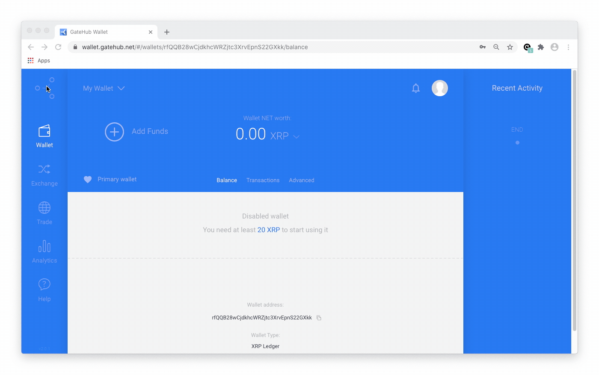
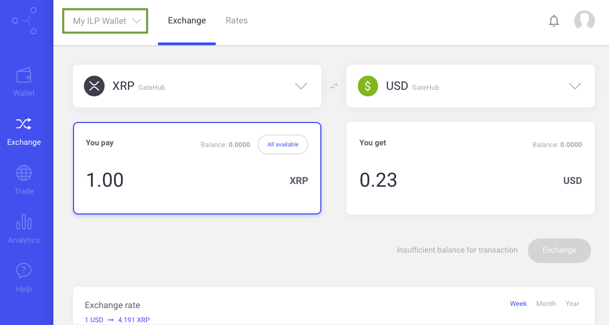

Use GateHub to have your earnings paid out in XRP or any other supported
currency.

> You can see a list of supported currencies on [GateHub's support site](https://support.gatehub.net/hc/en-us/articles/360021426493-Supported-currencies).

## Sign up

1. Go to Gatehub.net and [sign up](https://signin.gatehub.net/signup) for an account.
2. Complete GateHub's account verification process.

> If you need help, check out their articles:
> * [Register a GateHub Account](https://support.gatehub.net/hc/en-us/articles/360021318533-Register-a-GateHub-Account)
> * [Verification process for an individual account](https://support.gatehub.net/hc/en-us/articles/360021131054-Verification-process-for-an-individual-account)

After your account is verified you can create your wallet on GateHub.

## Create your wallet

GateHub will assign a payment pointer to your wallet. A payment pointer is an identifier for your wallet that's safe to share with 3rd parties.

1. Log in to your [GateHub account](https://signin.gatehub.net).
2. Click the wallet drop-down arrow in the upper-left.
3. Click **+Add wallet**.
4. Select **Hosted** wallet.
5. Enter your password.
6. Enter a wallet name and click **Create**. Your wallet is now created.
7. Click **Add Funds**.
8. Select **Interledger Payment pointer**, then copy your payment pointer.
    > Refresh the page if you don't see the Interledger option. This is shown in the screen capture below.

Now you can share your payment pointer with other sites or add it to your own site by following the [Quick Start Guide](getting-started.md).

## Find your payment pointer

1. Log in to your [GateHub account](https://signin.gatehub.net).
2. If your Interledger wallet isn't selected by default, click the wallet drop-down arrow in the upper-left to select it.
3. Click **Add Funds**.
4. Select **Interledger Payment pointer**, then copy your payment pointer.

## Issue an exchange order

Payments are deposited into your GateHub account as XRP. GateHub allows you to
convert XRP into another currency for no charge before making a withdrawal.

1. Log in to your [GateHub account](https://signin.gatehub.net).
2. Select **Exchange** from the left navigation bar.
3. If your Interledger wallet isn't selected by default, click the wallet drop-down arrow in the upper-left to select it.
4. Select your currency exchange pair \(e.g., XRP to USD\) from the drop-down menus.
5. Enter the amount to exchange in the **You pay** field. The **You get** field
automatically displays the amount you'll receive.
6. Click the **Exchange** button, then confirm the transaction. When confirmed,
the exchange takes place immediately.

> More information can be found in GateHub's help article: [https://support.gatehub.net/hc/en-us/articles/360021425773-Exchange](https://support.gatehub.net/hc/en-us/articles/360021425773-Exchange)
