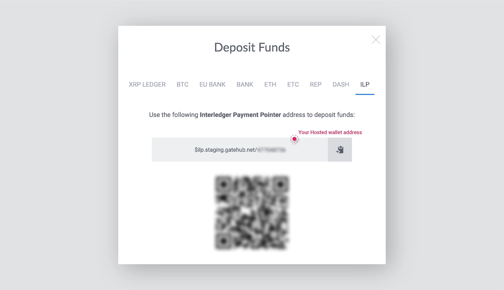
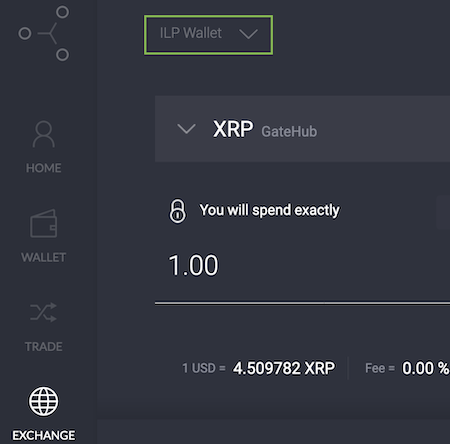
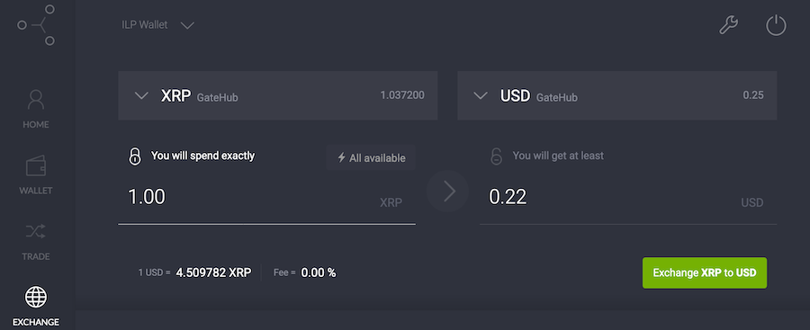

Use GateHub to have your earnings paid out in XRP or any other supported
currency.

> You can see a list of supported currencies on [GateHub's support site](https://support.gatehub.net/hc/en-us/articles/360021426493-Supported-currencies).

## Sign up

1. Go to Gatehub.net and [sign up](https://signin.gatehub.net/signup) for an account.
2. Complete GateHub's account verification process.

> If you need help, check out their articles:
> * [Register a GateHub Account](https://support.gatehub.net/hc/en-us/articles/360021318533-Register-a-GateHub-Account)
> * [Verification process for an individual account](https://support.gatehub.net/hc/en-us/articles/360021131054-Verification-process-for-an-individual-account)

After your account is verified you can create your wallet on GateHub.

## Create your wallet

1. Log in to your [GateHub account](https://signin.gatehub.net).
2. Select **Wallet** from the left navigation bar.
3. Click **\(+\)** in the upper-left.
4. Enter your password.
5. Enter a wallet name and select **Hosted** under **Wallet type**.
6. Click **Create**. Your wallet is now created on GateHub.
7. Click **Deposit/Receive** at the bottom of the screen.
8. Select the **ILP** tab and copy your payment pointer to your clipboard.



## Create your meta tag

Create your `<meta>` tag by using the [Meta Tag Generator](/meta-tag) or by
following the example below.

The tag's `name` is always `monetization`. The `content` is your payment
pointer.

### Example meta tag
```html
<meta
  name="monetization"
  content="$wallet.example.com/alice">
```

You're now ready to add your meta tag to the `<head>` section of each page you
want to monetize.

## Issue an exchange order

Payments are deposited into your GateHub account as XRP. GateHub allows you to
convert the XRP into another currency for no charge before making a withdrawal.

1. Log in to your [GateHub account](https://signin.gatehub.net).
2. Select **Exchange** from the left navigation bar.
3. Select your ILP wallet from the top-left menu.

   

4. Select your currency exchange pair \(e.g., XRP to USD\) from the drop-down menus.
5. Enter the amount to exchange in the first field. The second field
automatically displays the amount you'll receive.
6. Click the **Exchange** button then confirm the transaction. When confirmed,
the exchange takes place immediately.



> More information can be found in GateHub's help article: [https://support.gatehub.net/hc/en-us/articles/360021425773-Exchange](https://support.gatehub.net/hc/en-us/articles/360021425773-Exchange)
