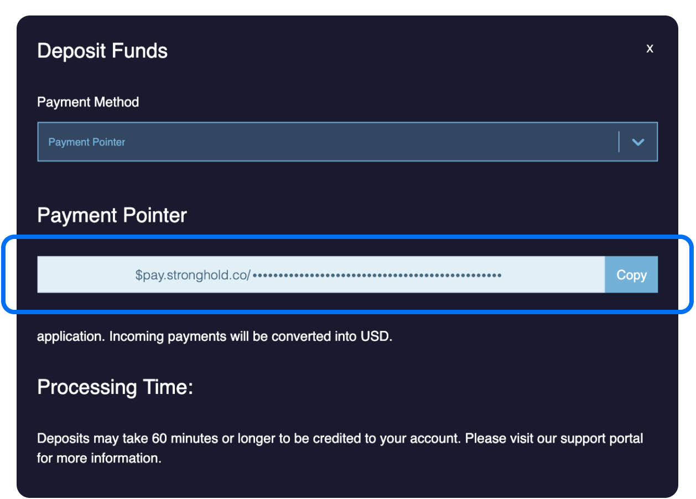

Use Stronghold to have your earnings paid out in US dollars.

> You won't see your payments immediately if the amount you've received is
beneath Stronghold's threshold of approximately $0.002.

Local regulations prevent Stronghold from supporting certain countries and regions. Check out their [help article](https://happiness.stronghold.co/hc/en-us/articles/360026140812-Countries-and-regions-supported-by-Stronghold) for more information.

## Sign up and find your payment pointer

1. Go to stronghold.co and [sign up](https://identity.stronghold.co/signup) for
an account.
2. On the Stronghold Launchpad click **My USD Payment Pointer**. Stronghold will open a popup displaying your payment pointer.
3. Copy your payment pointer to your clipboard.

Now you can share your payment pointer with other sites or add it to your own site by following the [Quick Start Guide](./getting-started).

