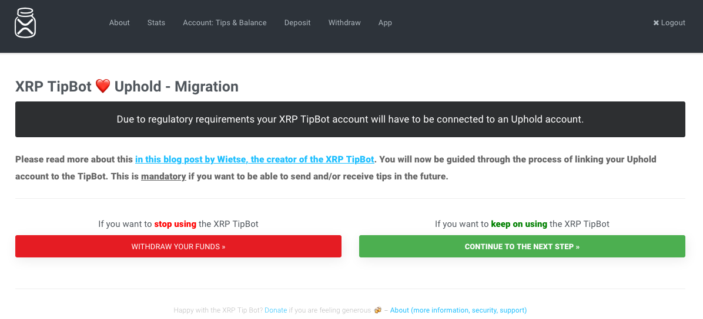
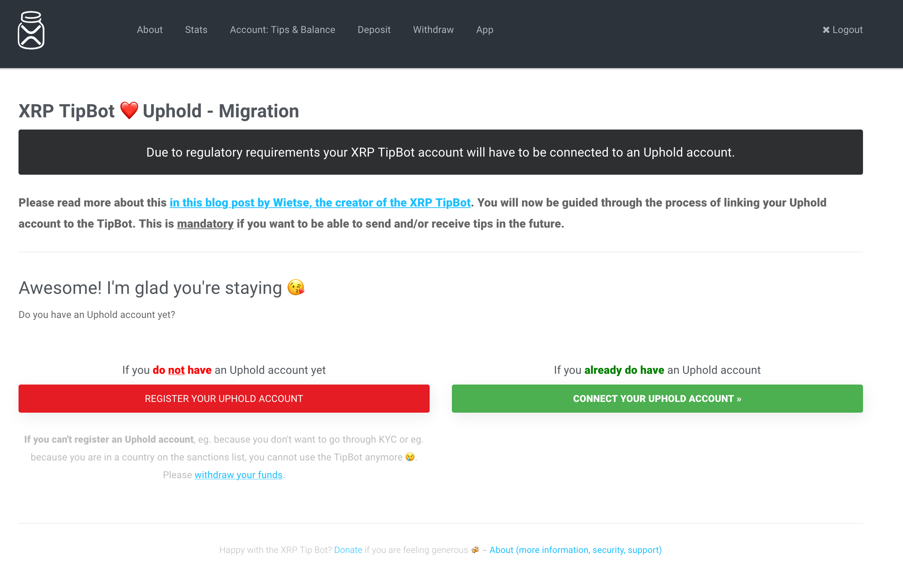
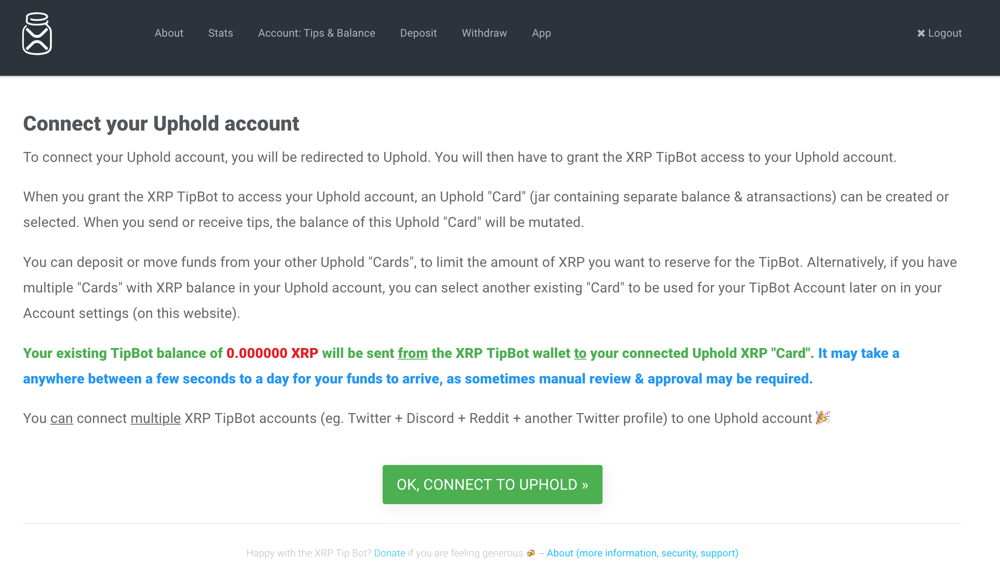
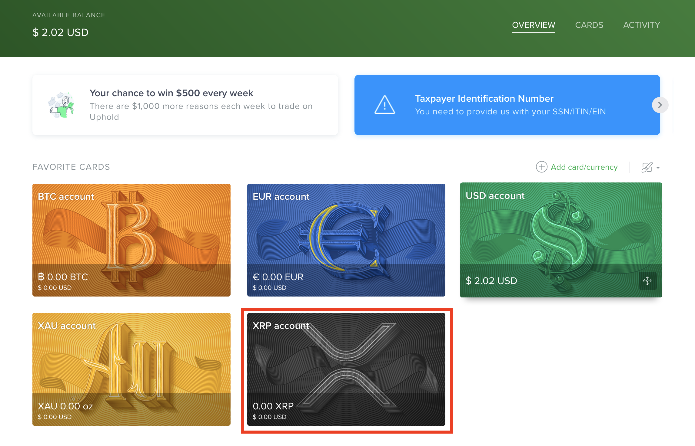
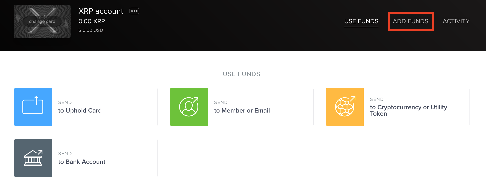
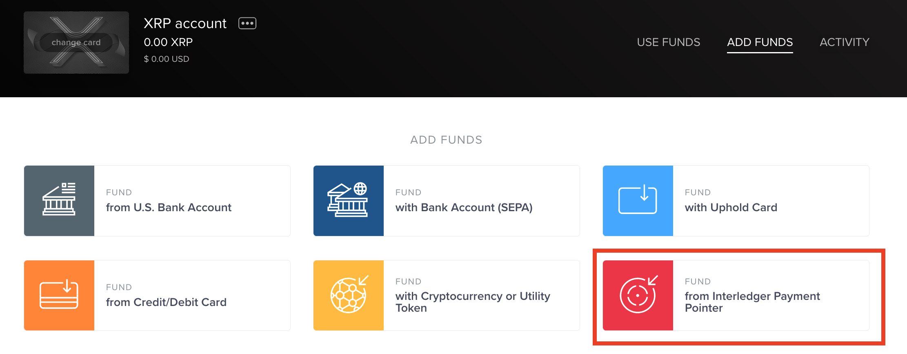
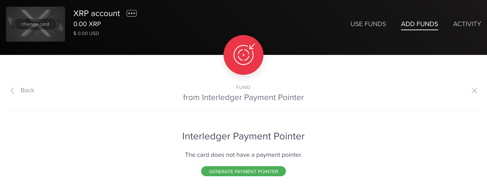
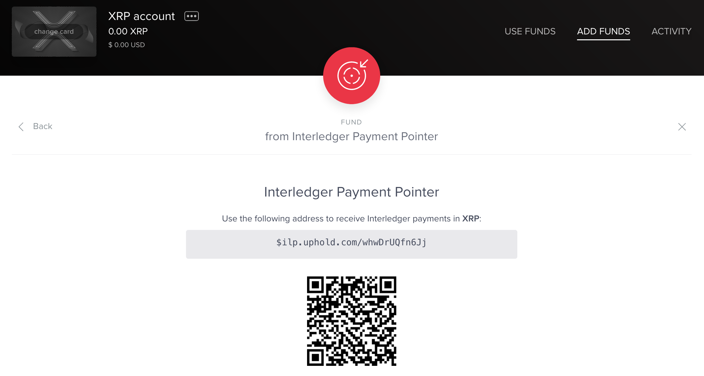
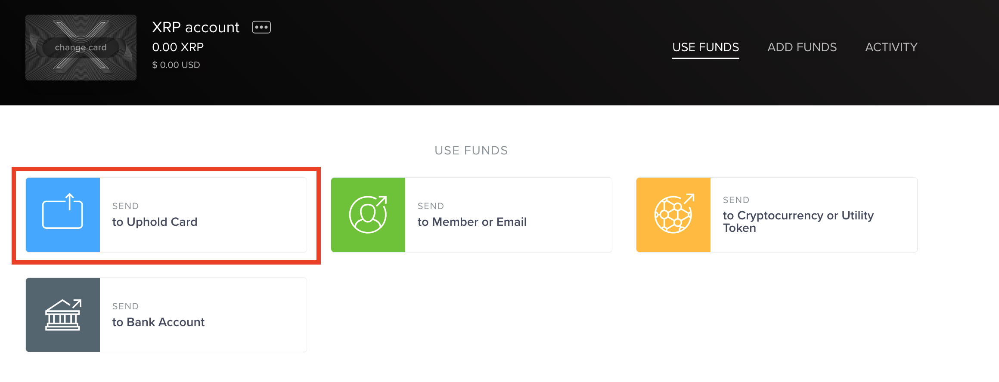
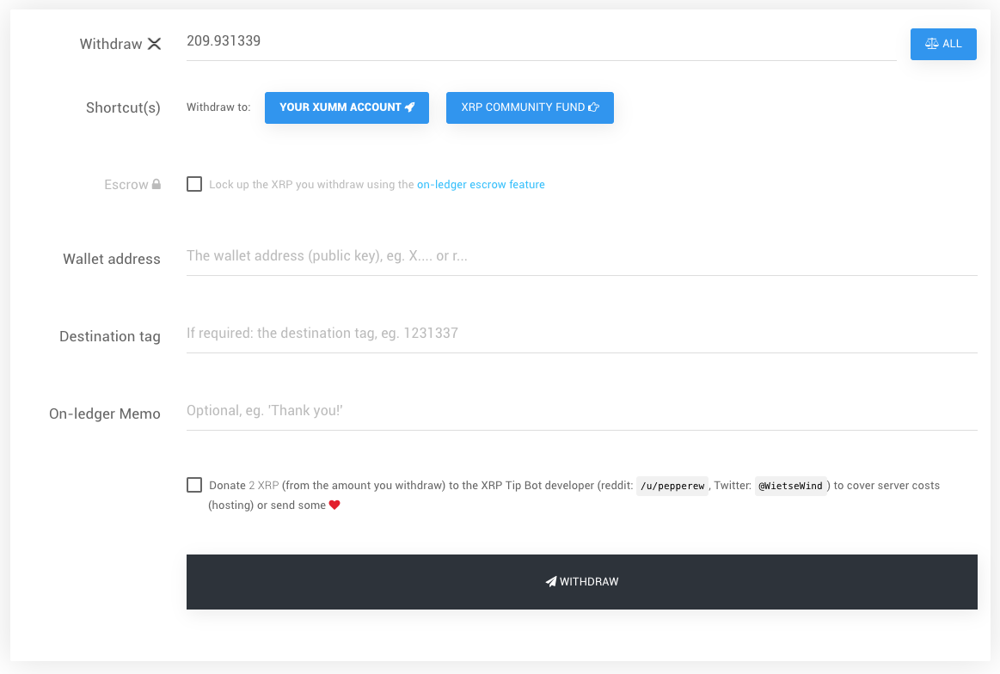

import XrpMigration05 from './assets/xrpmigration/xrpMigration05.png';
import XrpMigration06 from './assets/xrpmigration/xrpMigration06.png';
import XrpMigration13 from './assets/xrpmigration/xrpMigration13.png';

## NOTICE

If you are an XRP TipBot user, **you must link your account to [Uphold](uphold.md)** to be able to send and/or receive tips in the near future. This change is due to the passage of the European Union’s 5th Anti-Money Laundering Directive (AMLD5). XRP TipBot is not going away immediately, but you should either **migrate** your balance to Uphold or **withdraw** your balance as soon as possible. When you sign into your XRP TipBot account, you’ll be guided through migrating or withdrawing.

> Uphold is in the process of obtaining a BitLicense in the state of New York. Until the BitLicense is issued they cannot support cryptocurrency transactions. If you reside in New York, you’ll need to withdraw your funds from the TipBot. You can still set up an Uphold account for fiat money but it won’t be linked to XRP TipBot.

## Migrate to Uphold

### Connect your account

1. Click **Continue to the next step**.

2. Click **Register** if you don’t have an Uphold account yet. You’ll be taken to [Uphold’s sign up page](https://uphold.com/signup).

3. If you do have an Uphold account, click **Connect**.

4. If you clicked **Connect**, review the information on this page carefully.

5. Click **OK, connect to Uphold**. Uphold’s sign in page opens.

6. Sign in to your account. You’ll be prompted to authorize Uphold to connect to XRP TipBot.

7. Click **Authorize**.

After you authorize Uphold, your browser might take you back to the XRP TipBot screen with the **OK, connect to Uphold** button. That’s fine. Uphold will send you a confirmation email within a few minutes.

### Migrate your balance

If you have a balance in your TipBot account, you’ll find a notification and button to migrate your balance to your linked Uphold account. Wait until you’ve received the confirmation email before migrating.

Click **Migrate** then access your Uphold account. Locate the XRP account card on the dashboard. This card contains the balance from your XRP TipBot account.

If you want to continue receiving XRP to this card, you’ll need to generate a new payment pointer, then add the pointer to any of your personal websites that use the `monetization` meta tag.

If you want to want to convert some or all of your balance to a different currency, or move your XRP to another XRP card (if you already have one), you can do that too. Your Uphold account lets you receive funds on any currency card using Interledger (ILP). You are not limited to receiving only XRP.

### Generate a payment pointer for new XRP card

1. Click the card.

2. Click **Add Funds**.

3. Click **Fund from Interledger Payment Pointer**.

4. Click **Generate payment pointer**.

5. Copy your payment pointer.

6. Add your payment pointer to any personal websites using the `monetization` meta tag.

### Convert or move your XRP TipBot balance

When you sign up for Uphold, they provide you with a few empty (unfunded) cards set up for different currencies. If you want to convert your XRP TipBot balance to another currency or move your balance to an existing XRP card (if you already have one), perform the following steps.

1. Click your XRP TipBot card.

2. Click **Send to Uphold Card**.

3. Select the **Transfer To card**. Enter the amount of XRP you want to transfer. The screen will refresh to show how much the XRP is worth if your Transfer To card is in a different currency.

4. Click **Confirm**.

## Withdraw your funds

Click **Withdraw your funds**.

Complete the withdrawal form and click **Withdraw**.

