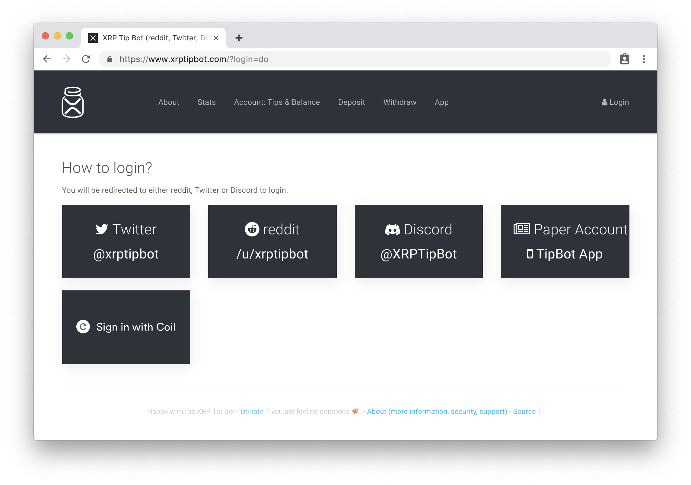
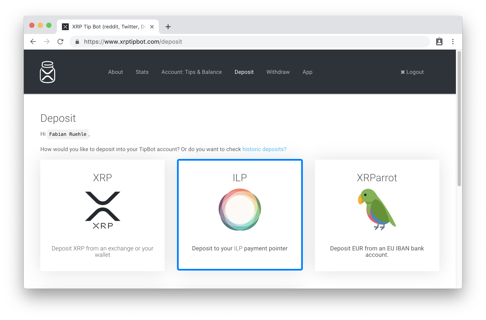
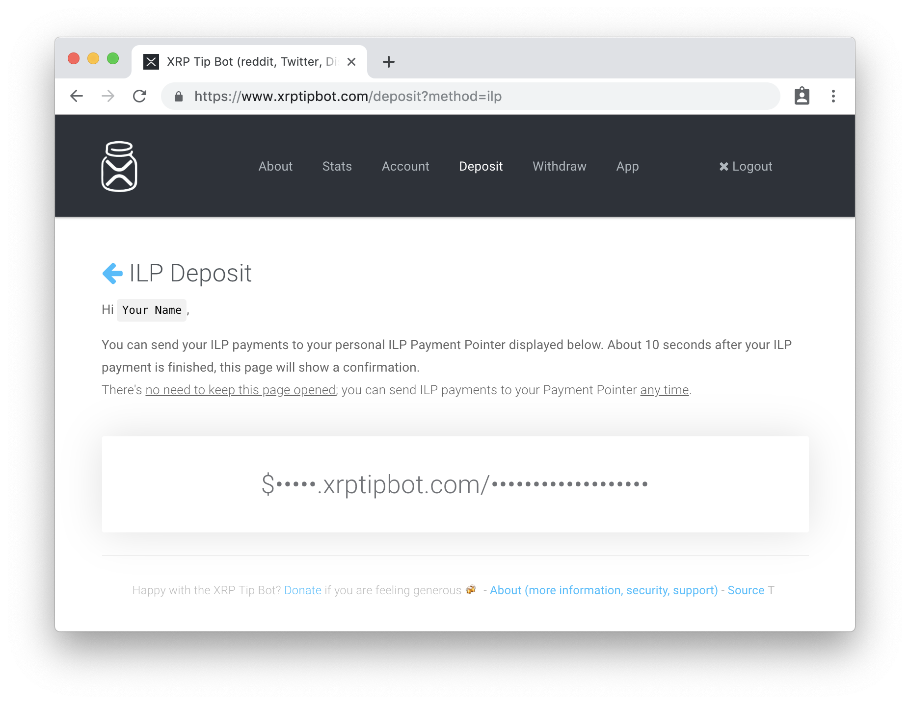

Use XRP Tip Bot to have your earnings paid out in XRP. The bot updates balances about every 30 minutes, so you won't see payments right away.

## Sign in

Go to [XRP Tip Bot](https://www.xrptipbot.com/?login=do) and choose how you want to sign in.



## Select a deposit type

1. Select **Deposit** from the top navigation bar.
2. Select **ILP** \(Interledger Protocol\).



## Get your payment pointer

When you select the ILP deposit type you're provided a payment pointer. Copy it to your clipboard.



## Create your meta tag

Create your `<meta>` tag by using the [Meta Tag Generator](/meta-tag) or by
following the example below.

The tag's `name` is always `monetization`. The `content` is your payment
pointer.

### Example meta tag
```html
<meta
  name="monetization"
  content="$wallet.example.com/alice">
```

You're now ready to add your meta tag to the `<head>` section of each page you
want to monetize.
