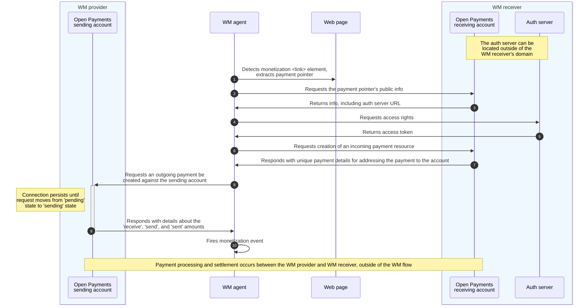

import { Tabs, TabItem } from '@astrojs/starlight/components'
import { CodeBlock, LargeImg, LinkOut, MermaidWrapper, Tooltip } from '@interledger/docs-design-system'

Web Monetization (WM) relies on <LinkOut href="https://openpayments.guide">Open Payments</LinkOut> (OP) and OP-enabled accounts to coordinate payments.

The <Tooltip content='Code in a web browser, such as an extension, that discovers web monetized pages, exposes the Web Monetization API, and communicates with the Open Payments APIs' client:load><a href="/docs/resources/glossary#web-monetization-agent">WM agent</a></Tooltip> first issues a series of API calls to the receiving account's <Tooltip content='A URL that identifies an Open Payments account' client:load><a href="/docs/resources/glossary#payment-pointer">payment pointer</a></Tooltip>, then to the sending account's payment pointer, to obtain the necessary authorization and instructions for sending a payment.

## Sequence diagram

<MermaidWrapper client:load>

</MermaidWrapper>

## Web Monetization flow example

This section provides an example of the API calls that occur when a web monetized user visits a web monetized site.

There's a few points to keep in mind as you review the example.

- It's up to the site visitor, not the web monetized site, to decide how often and how much to pay, as well as the currency in which to send a payment.
- While Web Monetization and Open Payments work together to coordinate payments, neither moves money. Payment processing and settlement must occur between the sending and receiving accounts over a common payment rail.

### Scenario

Alice adds the monetization `<link>` element to her website. Included within the `<link>` is her payment pointer, `https://wallet.example/alice`, assigned to her by her <Tooltip content='An entity that provides an Open Payments-enabled account into which payments can be received' client:load><a href="/docs/resources/glossary#web-monetization-receiver">WM receiver</a></Tooltip>.

Bob signs up with a <Tooltip content='An entity that provides a funded Open Payments-enabled account from which payments can be sent' client:load><a href="/docs/resources/glossary#web-monetization-provider">WM provider</a></Tooltip> who supplies him with a funded sending account. The sending account's payment pointer is `https://anotherwallet.example/bob`. After installing a WM agent in his browser and linking the WM agent to his WM provider, his WM agent now has permission to request payments be sent from his account.

:::note
This example assumes the WM provider and WM receiver have already peered with each other and share a common payment rail over which transactions can be processed and settled.
:::

### 1 - Check for Web Monetization

As Bob browses Alice's site, his WM agent detects a monetization `<link>` element.

```html
<link rel="monetization" href="https://wallet.example/alice" />
```

### 2 - Send request to payment pointer (receiving account)

<Tabs>
	<TabItem label="Request">
    The WM agent issues a request to Alice's payment pointer to discover the Open Payments service endpoint.
    
    <CodeBlock title="Request">
    ```http
    GET /alice HTTP/1.1
    Accept: application/json
    Host: wallet.example
    ```
    </CodeBlock>
  </TabItem>
  <TabItem label="Response">
    The response includes, among other details, the URL for her WM receiver's grant request endpoint (authorization server).

    <CodeBlock title="Response">
    ```http
    HTTP/1.1 200 Success
    Content-Type: application/json

    {
      "id":"https://wallet.example/alice",
      "assetCode":"USD",
      "assetScale":2,
      "authServer":"https://wallet.example/auth"
    }
    ```
    </CodeBlock>

  </TabItem>
</Tabs>

### 3 - Send grant request to WM receiver's auth server

<Tabs>
	<TabItem label="Request">
    The WM agent issues a request to the WM receiver's grant request endpoint (authorization server) to get an access token.
    
    In this example, the WM agent requests access to create and read incoming payments (i.e., payments coming in to Alice's WM receiver).
    
    <CodeBlock title="Request">
    ```http
    POST /auth/ HTTP/1.1
    Accept: application/json
    Content-Type: application/json
    Host: wallet.example
    Content-Length: 218
    
    {
      "access_token":{
        "access":[
          {
            "type":"incoming-payment",
            "actions":[
              "create",
              "read"
            ],
            "identifier":"https://wallet.example/alice"
          }
        ]
      },
      "interact":{
        "finish":{
        "method":"redirect"
      }
    },
    "client":"https://anotherwallet.example/bob"
    }
    ```
    </CodeBlock>
  </TabItem>
  <TabItem label="Response">
    The grant request is non-interactive, so the WM receiver grants the request and issues an access token.
    
    <CodeBlock title="Response">
    ```http
    {
      "access_token":{
        "value":"OS9M2PMHKUR64TB8N6BW7OZB8CDFONP219RP1LT0",
        "manage":"https://wallet.example/auth/token/dd17a202-9982-4ed9-ae31-564947fb6379",
        "access":[
          {
            "type":"incoming-payment",
            "actions":[
              "create",
              "read"
            ],
            "identifier":"https://wallet.example/alice"
          }
        ]
      }
    }
    ```
    </CodeBlock>
  </TabItem>
</Tabs>

### 4 - Send incoming payment request to payment pointer (receiving account)

<Tabs>
  <TabItem label="Request">
    The WM agent creates an incoming payment for the session (e.g., the open browser tab) by issuing an incoming payment request to Alice's payment pointer. The request uses details obtained from the previous API calls.

:::note
The request is for an _incoming_ payment because the WM agent is requesting that Alice's account accept an incoming payment. The payment itself has not been sent yet.
:::

    <CodeBlock title="Request">
    ```http
    POST /alice/incoming-payments HTTP/1.1
    Accept: application/json
    Content-Type: application/json
    Authorization: OS9M2PMHKUR64TB8N6BW7OZB8CDFONP219RP1LT0
    Host: wallet.example
    ```
    </CodeBlock>

  </TabItem>
  <TabItem label="Response">
    Alice's WM receiver (who hosts her account and payment pointer) approves the request by supplying unique payment details for the WM agent to use to address the payment to Alice's account.
    
    <CodeBlock title="Response">
    ```http
    {
      "id":"https://wallet.example/alice/incoming-payments/08394f02-7b7b-45e2-b645-51d04e7c330c",
      "paymentPointer":"https://wallet.example/alice",
      "receivedAmount":{
        "value":"0",
        "assetCode":"USD",
        "assetScale":2
        },
      "completed":false,
      "createdAt":"2022-03-12T23:20:50.52Z",
      "updatedAt":"2022-03-12T23:20:50.52Z"
    }
    ```
    </CodeBlock>
  </TabItem>
</Tabs>

### 5 - Send outgoing payment request to payment pointer (sending account)

<Tabs>
  <TabItem label="Request">
    The WM agent uses the details obtained thus far to create an outgoing payment request against Bob's account (via his payment pointer). Note that this is just a request to send a payment. The payment itself has not been sent and the request is in a pending state. 
    
    <CodeBlock title="Request">
    ```http
    POST /bob/outgoing-payment HTTP/1.1
    Accept: application/json
    Content-Type: application/json
    Authorization: {{ outgoingPaymentGrant.accessToken.value }}
    Host: anotherwallet.example
    ```
    </CodeBlock>
  </TabItem>
  <TabItem label="Response">
    A successful response indicates the request has moved from a pending state to a sending state. This means Bob's account has the funds to cover the payment. Note that the payment itself has still not been sent (`"sentAmount":{"value":"0"}`).
    
    <CodeBlock title="Response">
    ```http
    {
      "id":"https://anotherwallet.example/bob/outgoing-payments/8c68d3cc-0a0f-4216-98b4-4fa44a6c88cf",
      "paymentPointer":"https://anotherwallet.example/bob/",
      "receiver":"https://wallet.example/alice/incoming-payments/08394f02-7b7b-45e2-b645-51d04e7c330c",
      "receiveAmount":{
        "value":"2",
        "assetCode":"USD",
        "assetScale":2
        },
      "sendAmount":{
        "value":"2",
        "assetCode":"USD",
        "assetScale":2
        },
      "sentAmount":{
        "value":"0",
        "assetCode":"USD",
        "assetScale":2
        },
      "createdAt":"2022-03-12T23:20:55.52Z",
      "updatedAt":"2022-03-12T23:20:55.52Z"
    }
    ```
    </CodeBlock>

    The Web Monetization flow is complete. It's now up to the WM provider to process the payment and settle with the WM receiver.

  </TabItem>
</Tabs>
