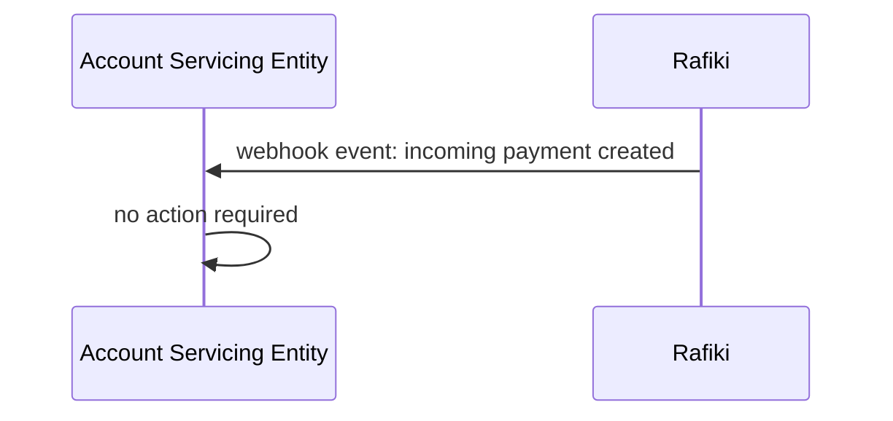
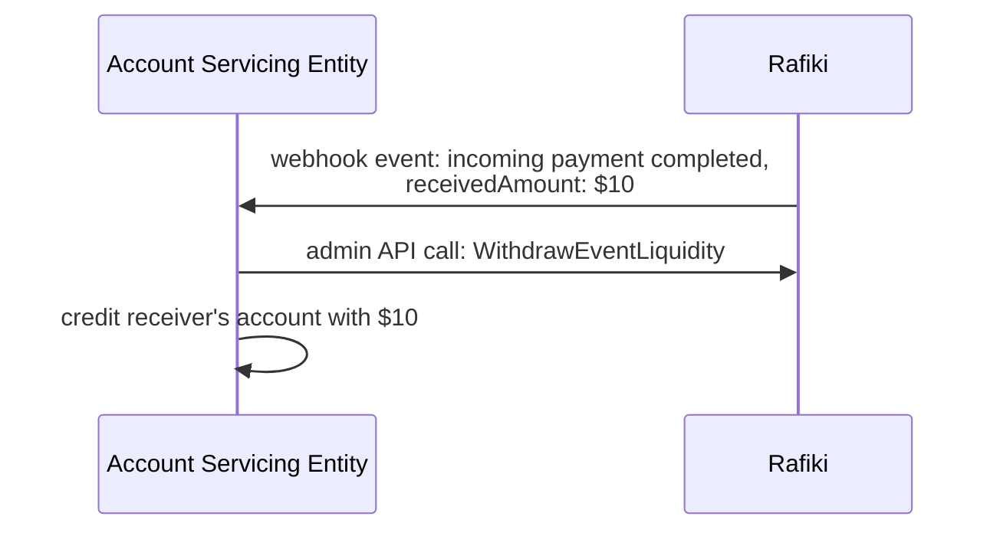
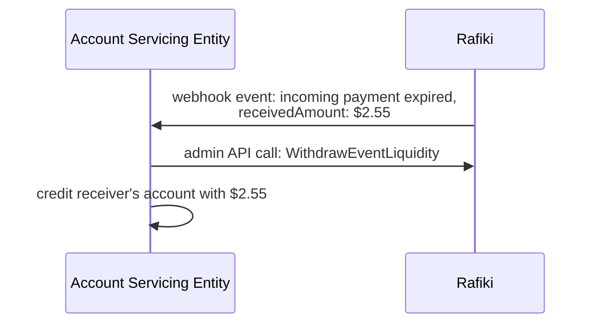
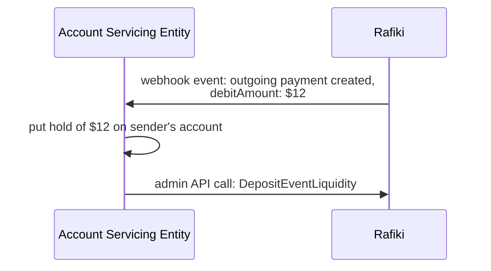
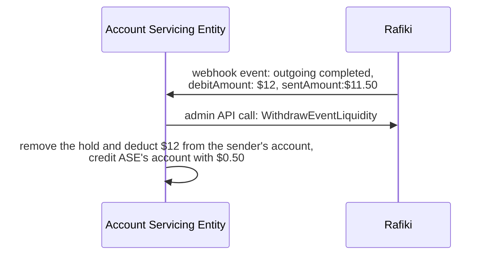
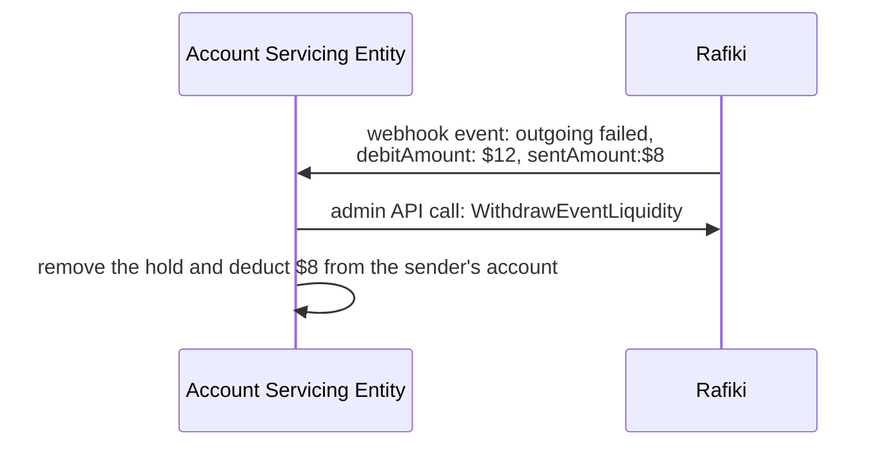
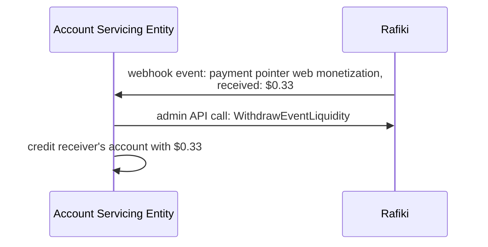
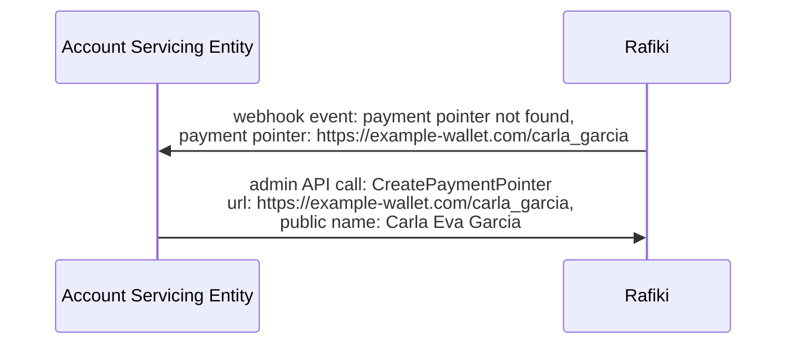
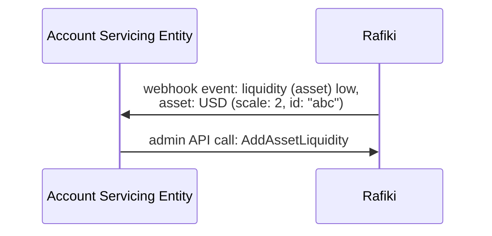
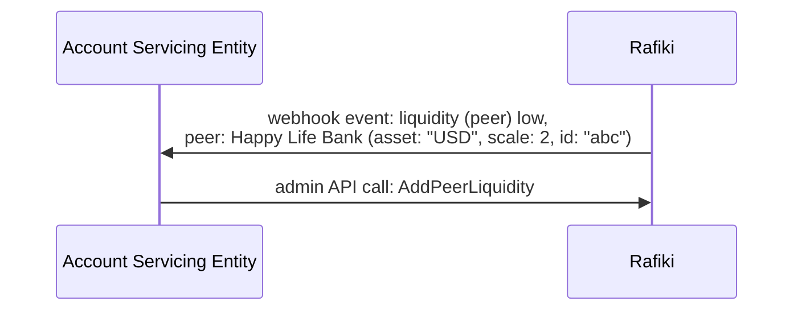

Rafiki communicates with the Account Servicing Entity over webhook events, as mentioned in the [_Getting Started_](./getting-started) section. Most events require the Account Servicing Entity interact with Rafiki, either to deposit or withdraw liquidity into or from Rafiki, or to provide payment pointer information. This document will describe how an Account Servicing Entity should handle each of the defined webhook events.

## `incoming_payment.created`

The `incoming_payment.created` event indicates that an incoming payment has been created. It has not yet received any funds so no action is required. The webhook event is informational and allows the Account Servicing Entity to display upcoming incoming payments to their users.

## `incoming_payment.completed`

The `incoming_payment.completed` event indicates that an incoming payment has been completed, either automatically or manually, and that any funds that have been received into this incoming payment should be withdrawn and credited to the recipient's account with the Account Servicing Entity.

Example: An incoming payment was completed and received $10.

## `incoming_payment.expired`

The `incoming_payment.expired` event indicates that an incoming payment has expired, and that any funds that have been received into this incoming payment should be withdrawn and credited to the recipient's account with the Account Servicing Entity. Note that this event is not fired if there were no funds received by the incoming payment since there is no action required by the Account Servicing Entity.

Example: An incoming payment has expired and received $2.55.

## `outgoing_payment.created`

The `outgoing_payment.created` event indicates that an outgoing payment has been created and is awaiting liquidity. The Account Servicing Entity should put a hold on the sender's account and deposit the funds into Rafiki.

Example: An outgoing payment for $12 has been created.

## `outgoing_payment.completed`

The `outgoing_payment.completed` event indicates that an outgoing payment has successfully sent as many funds as possible to the receiver. The Account Servicing Entity should withdraw any access liquidity from that outgoing payment in Rafiki and use it as they see fit. One option would be to return it to the sender. Another option is that the access liquidity is considered a fee and retained by the Account Servicing Entity. Furthermore, the Account Servicing Entity should remove the hold on the sender's account and debit it.

Example: An outgoing payment for $12 has been completed. $11.50 were sent. The Account Servicing Entity keeps $0.50 as fees.

## `outgoing_payment.failed`

The `outgoing_payment.failed` event indicates that an outgoing payment has either partially or completely failed and a retry was also unsuccessful. The Account Servicing Entity should withdraw any remaining liquidity from that outgoing payment in Rafiki. If the payment failed completely (the `sentAmount` was 0), the Account Servicing Entity should remove the hold from the sender's account. If the payment failed partially, the Account Servicing Entity should remove the hold from the sender's account and debit it with the amount that has been sent, but they should refrain from taking a sending fee.

Example: An outgoing payment for $12 has failed. $8 were sent.

## `payment_pointer.web_monetization`

The `payment_pointer.web_monetization` event indicates that a payment pointer has received web monetization payments via STREAM (raw ILP access). The Account Servicing Entity should withdraw that liquidity from the payment pointer and credit the receiver's account.

Example: A payment pointer received $0.33

## `payment_pointer.not_found`

The `payment_pointer.not_found` event indicates that a [payment pointer](/reference/glossary#payment-pointer) was requested (via the [Open Payments API](/reference/glossary#open-payments)), but it doesn't exist in Rafiki. When receiving this event, the Account Servicing Entity can perform a lookup for the relevant account in their system, and [create](./getting-started#issuing-payment-pointers) a payment pointer. The initial request for the payment pointer will succeed if the Account Servicing Entity creates it within the configurable [`PAYMENT_POINTER_LOOKUP_TIMEOUT_MS`](/integration/deployment#environment-variables) timeframe.

Example: The payment pointer `https://example-wallet.com/carla_garcia` was requested but does not yet exist

## `asset.liquidity_low`

The `asset.liquidity_low` event indicates that the liquidity of an [asset](../reference/glossary#asset) has dropped below a predefined liquidity threshold. When receiving this event, the Account Servicing Entity should check if they have or can acquire additional liquidity of said asset and if so, deposit it in Rafiki. If the Account Servicing Entity cannot or does not increase the asset liquidity in Rafiki, cross-currency transfers will fail.

Example: The asset liquidity for USD (scale: 2) drops below 100.00 USD.

## `peer.liquidity_low`

The `peer.liquidity_low` event indicates that the liquidity of a [peer](../reference/glossary#peer) has dropped below a predefined liquidity threshold. When receiving this event, the Account Servicing Entity need to decide if they can extend said peer's credit line or whether they need to settle first and then extend a new line of credit. If the Account Servicing Entity cannot or does not increase the peer liquidity in Rafiki, transfers to that peer will fail.

Example: The peer liquidity for Happy Life Bank drops below 100.00 USD.

